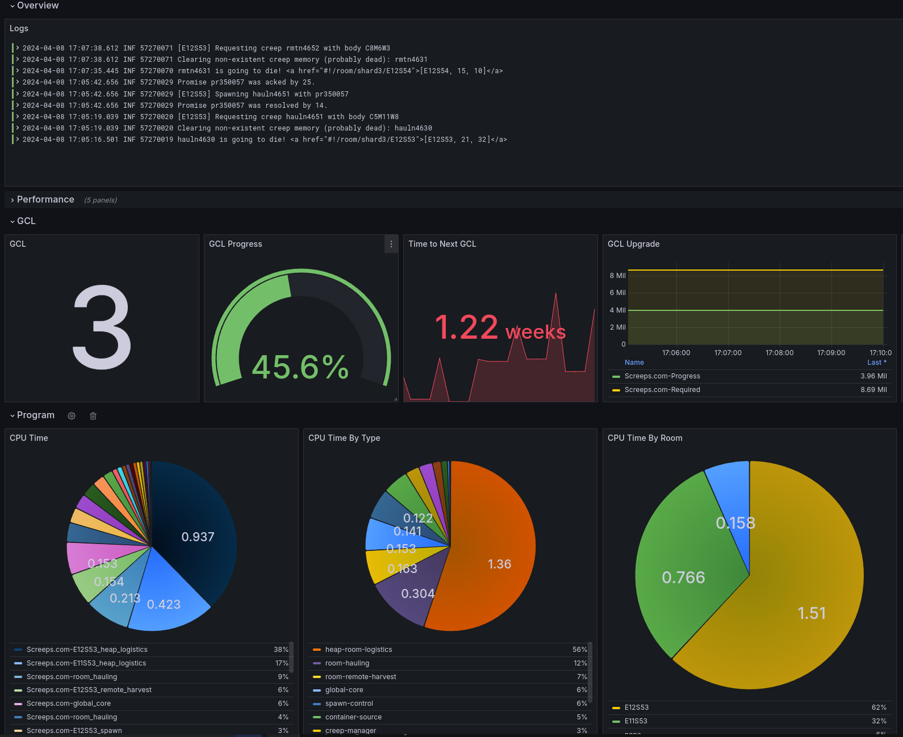

# Screeps Watcher



- [Demo](https://snapshots.raintank.io/dashboard/snapshot/Mk6wQM764uJKnMINsHduIrIrDtKUqO4I?orgId=0)

Screeps watcher is a collection of instrumentation and monitoring tools for the game Screeps. It is designed to be used in conjunction with supporting Screep libraries to export data via memory segments.

The watcher can currently export console logs and prometheus style metrics from any number of screeps programs and shards.

```yaml
# config.yaml
servers:
  - name: Screeps.com
    url: https://screeps.com
    username: <email>
    token: <screep-api-token>
    # These targets scrape memory segments for the prometheus style metrics.
    # The format of the memory is a custom format that requires using the
    # screeps-watcher-metrics library to export the data.
    targets:
      # Choose the shard and memory segment to scrape.
      - metrics_segment: 77
        shard: shard3
      # You can do multiple shards!
      - metrics_segment: 77
        shard: shard2
    websocket_channels:
      # When exporting logs, using the screeps-watcher-logs library will
      # allow setting log levels.
      - console # Export console logs!
      - cpu # Exposes some cpu & memory metrics.
  # Track some more servers!
  - name: PrivateServer
    url: http://<private-ip>:21025
    username: <email>
    password: <password>
    targets:
      # Choose the shard and memory segment to scrape.
      - segment: 77
```


## Prometheus style metrics.

Prometheus style metrics supports gauges. The screeps metrics are scraped via the watcher and made available on a prometheus endpoint.


